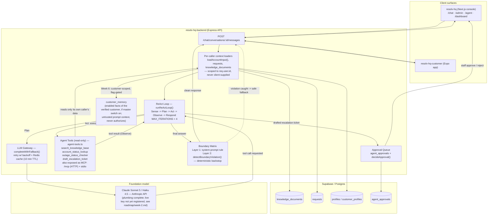
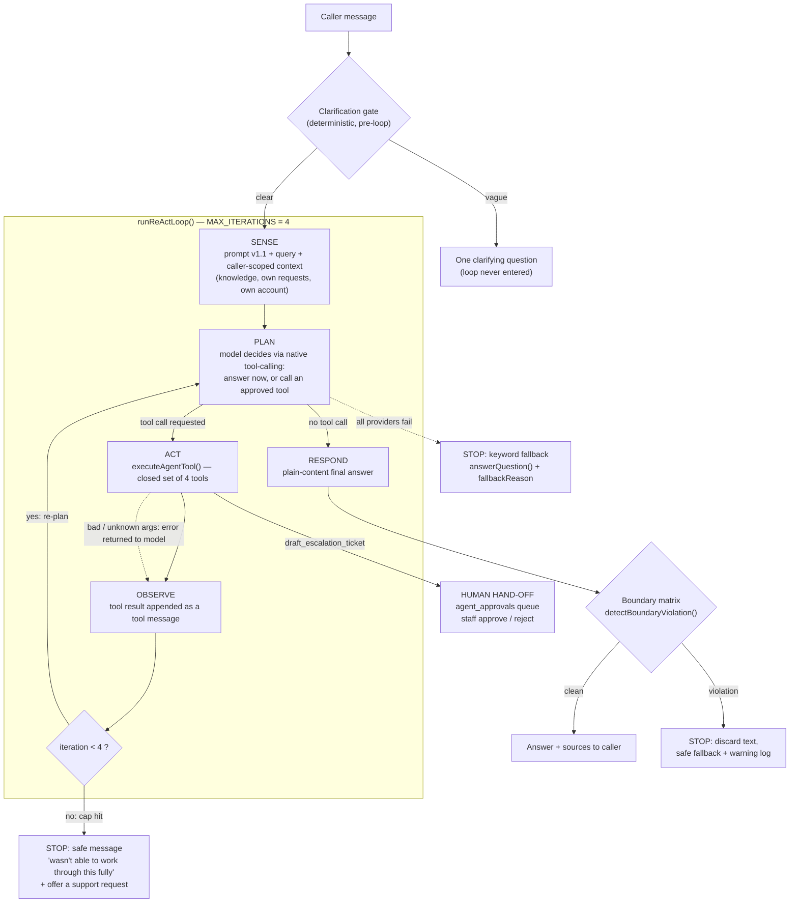

# Architecture Diagram — RESOLV-HQ

**Status:** first version — no diagram existed before this (flagged as a gap in every week from [`roadmap/week-1.md`](./roadmap/week-1.md) onward). Written now, at Week 4, with the tool-calling layer as the headline addition; intended to be **extended in place** for Weeks 5–7 (agent-loop detail, memory, and additional guardrail evidence) rather than redrawn. | **Date:** 25 Sept 2026

## What's new this week (Week 4 — Tools and Function Calling)

The `Agent Tools` subgraph and the Act/Observe edges around it are this week's addition — the four read-only tools from [`tool-catalogue.md`](./tool-catalogue.md), called from the ReAct loop and scoped to per-caller data by the same loaders that feed the model's context. Everything else in the diagram (client surfaces, the LLM gateway, the boundary matrix, the approval queue) reflects what Weeks 1–3 already built, drawn once here so later weeks only need to add to it.

## Diagram

## Week 5 extension — the ReAct loop in detail (added 2 Oct 2026)

The `ReAct` node above is expanded here into its five phases, the `MAX_ITERATIONS = 4` stop condition, and every exit path, per the [Agent Task Contract](./agent-task-contract.md). The human hand-off sits on the `draft_escalation_ticket` branch of Act: the draft goes to the approval queue and nothing is filed by the agent.

**Exit paths (the only five):** normal answer · clarification question · iteration cap · boundary-violation fallback · gateway-unavailable keyword fallback. Customers and staff take identical paths (Contract §8).

**Build status:** every box is implemented. Not yet backed by a live-model trace: the iteration-cap and boundary exits, and live Act/Observe. See [`../evidence/traces/week-5-execution-traces.md`](../evidence/traces/week-5-execution-traces.md).

## Week 3 extension — the RAG retrieval path (added 3 Oct 2026)

The retrieval path the `Knowledge` and `search_knowledge_base` boxes above stand for, drawn end to end: ingestion → storage → ranking → context assembly → citation. Everything is traced to code in `resolv-hq-backend`; document inventory is in the [Corpus / Source Register](./corpus-source-register.md). Added late (Week 3's ask, drawn in Week 5/6) — it describes the code as it is on 3 Oct, not as it was in Week 3.

```mermaid
flowchart LR
    subgraph Ingest["1 · INGESTION  (staff upload, routes/admin/knowledge.ts)"]
        Up["Staff uploads PDF / text file"] --> Store["Original file stored\n(Supabase Storage)"]
        Up --> Ext["extractPages()\nPDF → per-page text\ntext → ~3000-char blocks"]
        Ext --> Chunk["chunkPage()\n~700-char passages\non sentence boundaries"]
    end

    subgraph Keep["2 · STORAGE  (Postgres)"]
        Docs[("knowledge_documents\ntitle · status · file")]
        Chunks[("knowledge_chunks\ncontent · chunk_index\nmetadata.page")]
    end

    Chunk --> Chunks
    Up --> Docs
    Docs -.->|"status = 'published'\nonly"| Load

    subgraph Retrieve["3 · RETRIEVAL  (per chat turn)"]
        Load["loadPublishedPassages()\nall published passages,\npage-tagged"]
        Rank["scoreText()\nstemmed keyword overlap\n+ small repeat bonus\n(no embeddings, no vector DB)"]
        Pick["keep score > 0\ntop 3 (tool) / top 1 (fallback)"]
        Load --> Rank --> Pick
    end

    Chunks --> Load

    subgraph Assemble["4 · CONTEXT ASSEMBLY"]
        Ctx["Passages placed in the prompt\n(Sense) and returned by\nsearch_knowledge_base (Act/Observe)\n500 chars each, with title + page"]
    end

    Pick --> Ctx
    Ctx --> Model["LLM via gateway\n(or keyword fallback if\nall providers fail)"]

    subgraph Cite["5 · CITATION"]
        Rule["Prompt rule: every claim cites\ndocument title + page"]
        Src["sources[] returned with the\nanswer → link to the document"]
    end

    Model --> Rule --> Src
    Src --> Out["Answer to caller"]
    Pick -.->|"nothing scores > 0"| NoHit["'Not covered — want me to\nraise a request?'"]
```

**Known weakness, shown on the diagram:** the only "no grounding" exit is the dashed `nothing scores > 0` edge. Because one shared word is enough to score, that edge almost never fires, so unrelated passages reach the model/fallback as if they were grounding. Evidence and cause: [`retrieval-grounding-failures.md`](./retrieval-grounding-failures.md) F2 and the [15-case evaluation](./rag-evaluation-15-case.md).

## Reading the diagram

- **Solid arrows** are built and working today; **dashed arrows** are a safety path that only fires on a violation (Boundary → API) or a fallback path.
- **`Loaders`** is the single authorization boundary in the whole system: every tool and every prompt context is built from data this one step already scoped to `req.user.id` — no tool has its own selector argument that could name a different caller. See [`tool-failure-auth-test-evidence.md`](./tool-failure-auth-test-evidence.md) for an executed proof of this.
- **`Claude`** is drawn as reachable today because the gateway code is complete (`model-abstraction-and-rate-limiting.md`) — the box's subtitle notes the one remaining gap (no live API key registered yet) so this diagram doesn't overclaim what's running versus what's wired.
- **Extend this diagram, don't replace it:**
  - ~~Week 5: expand the `ReAct` node into its own subgraph~~ — done 2 Oct, see the Week 5 extension above.
  - ~~Week 6: turn the `Loaders -> Memory` edge solid and add the MCP-style interface annotation to `Tools`~~ — done 9 Oct. See [`state-model.md`](./state-model.md) and [`mcp-style-interface-spec.md`](./mcp-style-interface-spec.md).
  - Week 7: annotate `Boundary` and `Approvals` with a pointer to the compiled Failure Catalogue and the 30+ scenario evaluation results once they exist.
