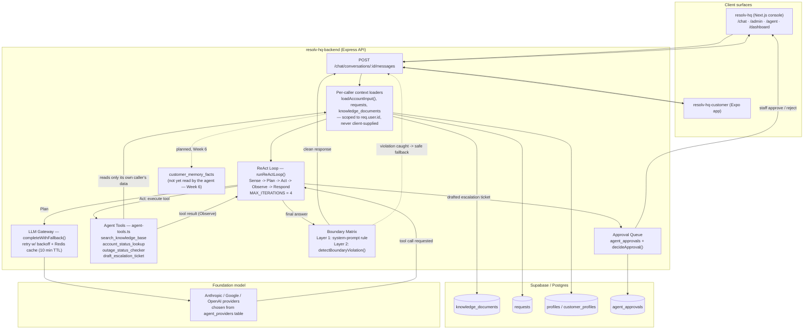
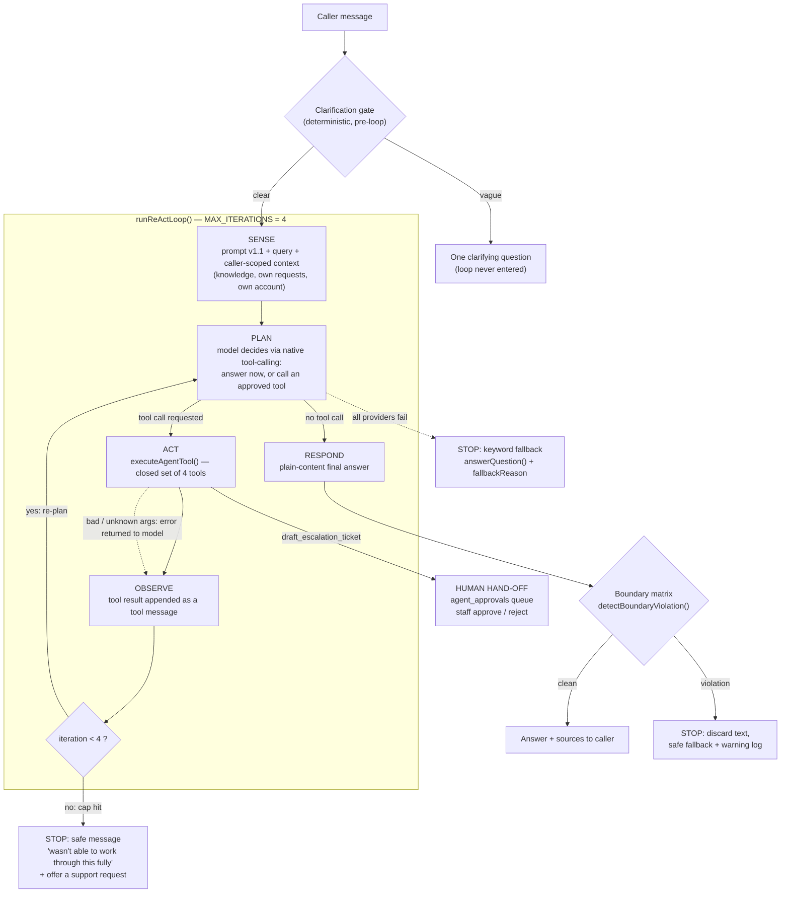

# Architecture Diagrams — Week 4 and Week 5

**Project:** RESOLV-HQ | **Dates:** Week 4 (21–25 Sep 2026), Week 5 (28 Sep – 2 Oct 2026)
Both diagrams are Mermaid, so they render on GitHub and in most Markdown viewers. They are the standalone copies of what lives in [`architecture-diagram.md`](./architecture-diagram.md).

---

## Week 4 — System architecture with the tool-calling layer

**Focus:** Tools and Function Calling. The headline addition is the `Agent Tools` box and the Act/Observe edges around it: four tools (`search_knowledge_base`, `account_status_lookup`, `outage_status_checker`, `draft_escalation_ticket`) called from the ReAct loop. See [`tool-catalogue.md`](./tool-catalogue.md).

**How to read it**
- Solid arrows are built and working; dashed arrows are a violation-only safety path or a planned item.
- `Loaders` is the single authorization boundary: every tool and prompt context comes from data already scoped to `req.user.id`, and no tool takes a customer selector argument.
- Evidence: [`tool-failure-auth-test-evidence.md`](./tool-failure-auth-test-evidence.md).

---

## Week 5 — The bounded agent loop in detail

**Focus:** Agent Architecture and Bounded Autonomy. The `ReAct` node above is expanded into its five phases, the `MAX_ITERATIONS = 4` stop condition, every exit path, and the human hand-off. See [`agent-task-contract.md`](./agent-task-contract.md).

**How to read it**
- **Exit paths (the only five):** normal answer, clarification question, iteration cap, boundary-violation fallback, gateway-unavailable keyword fallback.
- The agent never files anything: a drafted escalation goes to the approval queue and only staff can approve it.
- Customers and staff take identical paths.

**What changed from Week 4 to Week 5**

| Aspect | Week 4 | Week 5 |
|---|---|---|
| Level of detail | Whole system, loop as one node | Loop opened into phases and exits |
| Stop conditions | `MAX_ITERATIONS = 4` noted in the node label | Cap, boundary, gateway and clarification exits drawn explicitly |
| Human hand-off | Approval queue shown as a side branch | Shown as the outcome of the `draft_escalation_ticket` Act step |
| Pre-loop gate | Not shown | Clarification gate added |

**Build status:** every box is implemented. Not yet backed by a live-model trace: the iteration-cap and boundary exits, and live Act/Observe ([`../evidence/traces/week-5-execution-traces.md`](../evidence/traces/week-5-execution-traces.md)).
