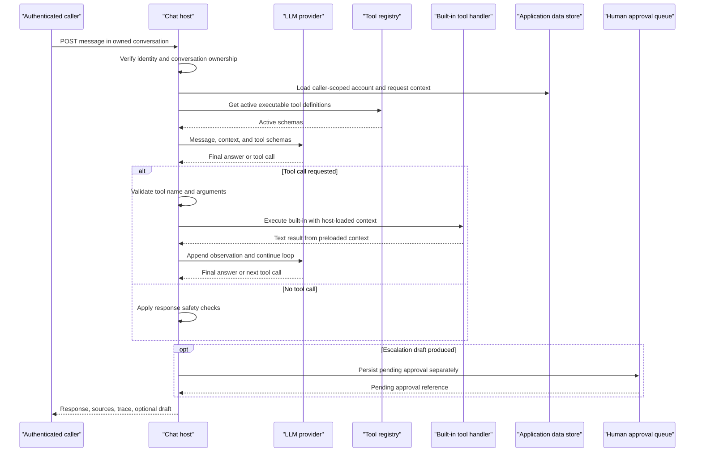

# MCP-Style Agent Tool Interface Specification

**Status:** Implemented for the four current tools over authenticated Streamable HTTP and stdio transports.  
**Contract revision:** 1.0  
**Implementation source:** `resolv-hq-backend/src/lib/agent-tools.ts`, `tool-registry.ts`, `react-agent.ts`, and `routes/chat.ts`.

## 1. Purpose and conformance

This document specifies a stable, MCP-style contract for the four tools currently offered to the model by the ReAct loop. It defines tool discovery, input and output shapes, caller authorization, result/error behavior, and the boundary between tool execution and the host application.

The backend exposes MCP `tools/list` and `tools/call` over Streamable HTTP at `/mcp` and a local stdio process. It also continues to use provider-native function calling inside authenticated `POST /chat/conversations/:id/messages`; these are separate invocation paths that share tool logic.

## 2. Service boundary and invocation

| Concern | Contract |
|---|---|
| Tool provider | Resolv-HQ backend (shared handlers used by the ReAct loop and the MCP server) |
| Chat invocation | Authenticated chat request; model requests a tool call, the backend executes it, then returns the observation to the model |
| MCP invocation | External MCP client calls `tools/list` / `tools/call` over an authenticated transport |
| MCP transports | Streamable HTTP at `/mcp`; stdio through the `mcp:stdio` command |
| Identity | Verified Supabase bearer-token identity, resolved by backend middleware; never accept a caller/customer ID in tool arguments |
| Current call scope | Chat conversation must belong to the authenticated identity |
| Current rate limits | Authenticated API: 300 requests per 5 minutes per caller; chat route: an additional 20 requests per minute per caller |
| Protocol version negotiation | Performed by the official MCP SDK; clients must use a protocol version supported by the installed SDK |
| Tool-set versioning | This document's contract revision is independent of MCP protocol versions. Additive tools may be added without changing existing names or argument meaning; changing a tool's name, input, output, or authority is a breaking contract revision |

### Tool discovery rules

The backend has a fixed set of executable handlers in code. The `agent_tools` registry controls whether a built-in is active; a registered row without a matching built-in handler is catalogue-only and is not advertised as callable. The MCP server fails closed if registry state cannot be established and rechecks activation on every call. Streamable HTTP creates a stateless transport per request, so discovery observes current active tools. A running stdio process advertises the active set captured at startup; restart it after changing tool activation so `tools/list` reflects the change. Inactive tools are rejected even if a client retained an older listing.

### MCP mapping

The implemented MCP server exposes only these capabilities:

- `tools` capability with `tools/list` discovery.
- `tools/call` for the four named tools below.
- No resources, prompts, sampling, elicitation, or logging capabilities are implied by this document.
- Mark tools with MCP annotations that describe their behavior (read-only, non-destructive, closed-world data); annotations are client hints only and never replace server-side authorization.

A listed tool provides its exact current name, description, `inputSchema`, normalized `outputSchema`, and read-only/non-destructive/closed-world annotations from the official MCP server SDK.

Example `tools/call` request:

```json
{
  "jsonrpc": "2.0",
  "id": 12,
  "method": "tools/call",
  "params": {
    "name": "account_status_lookup",
    "arguments": {}
  }
}
```

Successful MCP result shape:

```json
{
  "jsonrpc": "2.0",
  "id": 12,
  "result": {
    "content": [
      {
        "type": "text",
        "text": "Account status lookup completed."
      }
    ],
    "structuredContent": {
      "role": "customer",
      "status": "active",
      "organizationName": null,
      "city": null,
      "country": "Uganda",
      "memberSince": "unknown"
    },
    "isError": false
  }
}
```

The text content is for human/model readability; `structuredContent` must match the tool's normalized output schema. The example values are illustrative only and must be populated from the authenticated caller's context. For valid no-match results, return `isError: false` with an empty result collection. For handler failures, return an explicit MCP tool error (for example, `isError: true` with a diagnostic text content item) and do not provide fabricated `structuredContent`.

## 3. Shared contract rules

- Tool names are case-sensitive and must match exactly.
- Inputs are JSON objects. The schemas below use `additionalProperties: false`; arguments not defined by a tool are rejected by a conforming MCP adapter.
- `required: []` means the object is required but has no required properties.
- Current provider schemas describe types and required properties, but handler-level runtime validation is not a full JSON Schema validator. An adapter must validate inputs against the published schema before executing a handler.
- The current provider-native handlers return text observations to the model. The MCP server separately returns validated normalized structured content alongside text content.
- The tools are read-only or produce an in-memory draft. A tool invocation itself must not create, update, or delete customer records, support requests, or approvals.
- Results must not contain secrets, authentication tokens, unrelated profile data, or records outside the caller's permitted scope.
- Suggested tool annotations: `readOnlyHint: true`, `destructiveHint: false`, and `openWorldHint: false`. These are descriptive hints, not security controls.

## 4. Tool catalog

### `search_knowledge_base`

**Capability:** Search published knowledge passages for an answer grounded in available support material.

**Input schema:**

```json
{
  "type": "object",
  "properties": {
    "query": {
      "type": "string",
      "description": "The topic or question to search for."
    }
  },
  "required": ["query"],
  "additionalProperties": false
}
```

**Normalized output schema** (MCP `structuredContent`):

```json
{
  "type": "object",
  "properties": {
    "matches": {
      "type": "array",
      "items": {
        "type": "object",
        "properties": {
          "title": { "type": "string" },
          "page": { "type": ["integer", "null"] },
          "excerpt": { "type": "string" }
        },
        "required": ["title", "page", "excerpt"],
        "additionalProperties": false
      }
    },
    "message": { "type": "string" }
  },
  "required": ["matches", "message"],
  "additionalProperties": false
}
```

**Current result behavior:** Returns a text observation and structured result with at most three ranked passages. Each passage contains its title, optional page label, and a content excerpt truncated to 500 characters. When nothing matches, it returns `No matching knowledge base articles found.` The provider-native chat executor continues to consume its legacy text observation.

**Authorization and scope:** Searches the published knowledge passages loaded by the authenticated chat host. It does not search unpublished staff material.

**Side effects:** None.

**Failure behavior:** Empty/no-hit results are a normal result, not proof that a fact does not exist. A protocol adapter should return a successful tool result with an empty `matches` array and explanatory `message`; operational retrieval failures are returned as MCP tool errors (`isError: true`, no `structuredContent`), never as an empty success-shaped result.

### `account_status_lookup`

**Capability:** Retrieve the authenticated caller's basic account status and customer profile context.

**Input schema:**

```json
{
  "type": "object",
  "properties": {},
  "required": [],
  "additionalProperties": false
}
```

**Normalized output schema** (MCP `structuredContent`):

```json
{
  "type": "object",
  "properties": {
    "role": { "type": "string" },
    "status": { "type": "string" },
    "organizationName": { "type": ["string", "null"] },
    "city": { "type": ["string", "null"] },
    "country": { "type": "string" },
    "memberSince": { "type": "string" }
  },
  "required": ["role", "status", "organizationName", "city", "country", "memberSince"],
  "additionalProperties": false
}
```

**Current result behavior:** Returns both readable text and structured content with role, status, organization when present, location/country, and member-since value.

**Authorization and scope:** Resolves identity from the verified session on the server. It always reads the authenticated caller's own profile; a caller cannot select another account. Customer organization/location values are loaded only for a customer profile. Customer-facing context currently falls back to status `active`, country `Uganda`, and member-since `unknown` if those profile values are unavailable; adapters should preserve these exact semantics unless the implementation changes.

**Side effects:** None.

### `outage_status_checker`

**Capability:** Report unresolved support requests in the caller context.

**Input schema:**

```json
{
  "type": "object",
  "properties": {},
  "required": [],
  "additionalProperties": false
}
```

**Normalized output schema** (MCP `structuredContent`):

```json
{
  "type": "object",
  "properties": {
    "openIssues": {
      "type": "array",
      "items": {
        "type": "object",
        "properties": {
          "title": { "type": "string" },
          "status": { "type": "string" }
        },
        "required": ["title", "status"],
        "additionalProperties": false
      }
    },
    "message": { "type": "string" }
  },
  "required": ["openIssues", "message"],
  "additionalProperties": false
}
```

**Current result behavior:** Returns readable text plus a structured list and explanatory message. If there are no open requests, the result contains an empty list and `No known open issues — nothing currently on file is unresolved.`

**Authorization and scope:** For a customer, the MCP server loads only that customer's requests. For an authenticated staff caller (`admin` or `agent`), it loads all non-final requests, matching the current chat host; staff access is broader than customer access and must not be described as per-customer-only.

**Side effects:** None.

**Failure behavior:** An empty list means there are no unresolved requests in the caller's authorized scope; it does not prove the service has no incidents.

### `draft_escalation_ticket`

**Capability:** Prepare a proposed escalation for human review; the tool itself does not submit or persist it.

**Input schema:**

```json
{
  "type": "object",
  "properties": {
    "summary": {
      "type": "string",
      "description": "A one-sentence summary of the issue to escalate, based on the conversation so far."
    },
    "keyFacts": {
      "type": "string",
      "description": "Optional: the specific facts a human reviewer needs from the conversation so far — dates, order/account details mentioned, what the caller already tried. A few short bullet-style lines, not a transcript dump."
    },
    "suggestedAction": {
      "type": "string",
      "description": "Optional: what you think the human reviewer should do next."
    }
  },
  "required": ["summary"],
  "additionalProperties": false
}
```

**Normalized output schema** (MCP `structuredContent`):

```json
{
  "type": "object",
  "properties": {
    "title": { "type": "string" },
    "description": { "type": "string" },
    "category": { "type": "string" },
    "priority": { "type": "string", "enum": ["low", "normal", "high"] },
    "keyFacts": { "type": ["string", "null"] },
    "suggestedAction": { "type": ["string", "null"] },
    "submitted": { "const": false }
  },
  "required": ["title", "description", "category", "priority", "keyFacts", "suggestedAction", "submitted"],
  "additionalProperties": false
}
```

**Current result behavior:** The MCP handler trims the summary and optional strings, classifies the summary, and returns both text and structured content explicitly marked as not submitted. An empty/missing summary produces a tool error. The provider-native executor returns the formatted draft text; chat orchestration separately retains the structured draft.

**Authorization and scope:** Uses only arguments derived from the current conversation. Do not accept an arbitrary customer identifier or use this tool to fetch another customer's data.

**Side effects and approval boundary:** The tool handler is pure and does not write to the database. In the existing chat host, when a model turn produces this structured draft, the host separately records an `agent_runs` row and creates a pending `agent_approvals` record. This host-level behavior is not a side effect of MCP `tools/call`; the MCP tool only returns an in-memory draft and does not file a support request or create an approval record.

## 5. Authorization and security requirements

| Boundary | Requirement |
|---|---|
| Authentication | Require a verified bearer token; derive identity and role from server-verified claims/profile, not tool arguments |
| Customer isolation | Customer calls may use only their own requests and account details |
| Staff scope | `admin` and `agent` are staff roles. Existing staff chat context includes all non-final requests for `outage_status_checker`; do not silently present it as customer-scoped access |
| Tool availability | Advertise only executable built-ins that are active for the caller's environment; catalogue-only registry entries are not callable |
| Input validation | Validate the JSON object against the declared schema before dispatch; reject unknown properties and malformed values |
| Least privilege | Do not pass database clients, arbitrary SQL, filesystem access, credentials, or unscoped customer identifiers to a tool |
| Data minimization | Return only fields in the normalized output contract; truncate knowledge excerpts as described above |
| Authority | No tool can approve, submit, or execute a consequential action. Human approval remains an independent server-side gate |
| Transport | Streamable HTTP must be behind HTTPS in production and receives the same authenticated Supabase bearer token as the API. Stdio uses the `MCP_ACCESS_TOKEN` environment variable and represents the single account authenticated at process startup |
| Registry failures | The MCP server fails closed if identity, permission, or tool availability cannot be verified |

## 6. Error mapping

The current provider-native executor reports malformed model-call JSON, inactive tool names, and unknown tools as textual observations to the model. This is an internal recovery behavior, **not** the MCP error contract.

The MCP adapter behavior is:

| Condition | Adapter behavior |
|---|---|
| Invalid JSON-RPC/MCP request | Return the protocol's invalid-request/parse error; do not invoke a handler |
| Unknown tool name | Return the protocol's method/tool-not-found error |
| Tool inactive or not authorized | Return a tool result with `isError: true` and an "inactive" diagnostic; never dispatch the handler |
| Schema-invalid arguments | Return an invalid-parameters/tool-input error |
| Valid lookup with no matches | Return a successful result with an empty collection and explanatory message |
| Handler/database/provider failure | Return an explicit tool error; do not fabricate empty data or a success-shaped fallback |
| Escalation summary missing/empty | Return a tool-input error from the adapter; the current internal handler emits a text refusal |

Protocol parse, method, and input errors are emitted by the official MCP SDK for the negotiated protocol version. The current Express chat endpoint remains a separate REST endpoint.

## 7. Host-side chat API (current, not MCP)

| Method and path | Request | Response summary |
|---|---|---|
| `POST /chat/conversations/:id/messages` | JSON `{ "content": "..." }`; extra client memory fields are not authoritative | `201` JSON containing user and assistant messages, suggestions, steps, sources, trace, knowledge/open-request counts, and nullable escalation metadata |

The route is behind global `requireAuth`, verifies conversation ownership, and applies a 20-per-minute per-caller chat rate limit. The host loads customer memory server-side only for customer callers, only when the master preference is enabled, and only for enabled facts. Staff callers receive no customer memory. Customer-provided fields cannot select the memory owner.

The host route, not an MCP server, persists messages. When an escalation draft exists, the route also records its run and pending approval separately from execution of the in-memory draft tool.

## 8. Configuration and usage

### Streamable HTTP

Start the backend as usual and configure the MCP client to connect to `https://<backend-host>/mcp` (local development: `http://localhost:4000/mcp`) with an `Authorization: Bearer <Supabase access token>` header. The endpoint requires an authenticated profile and shares the API's per-caller rate limit plus a dedicated limit of 60 MCP HTTP requests per minute. Do not expose this endpoint over plain HTTP outside local development.

The transport is stateless: it does not issue MCP session IDs. The client must send the bearer token on each HTTP request. Allowed origins follow the API's `ALLOWED_ORIGINS` CORS configuration.

### Console MCP tester

Signed-in staff can test the HTTP endpoint from the admin console at **MCP Tester** (`/mcp` in `resolv-hq`, in the Governance sidebar group). It sends the same JSON-RPC requests as any client, using the staff member's own session, so results reflect the staff role's scope. It can list the advertised tools, call any tool with hand-edited JSON arguments (including a one-click unexpected argument), show the raw request and response, and run a smoke suite: `tools/list` matches the active registry, each tool succeeds with valid input, the escalation draft reports `submitted: false`, and an unexpected argument, a missing argument, a blank summary and an unknown tool are all rejected. All four tools are read-only or in-memory, so testing changes no customer data. The stdio transport cannot be called from a browser; test it with an MCP client such as the MCP Inspector.

### stdio

Build the backend, then configure an MCP client to launch `npm run mcp:stdio` with `MCP_ACCESS_TOKEN` set to a short-lived Supabase access token for the intended user. For development, `npm run mcp:stdio:dev` runs the TypeScript entry point directly. The process authenticates once at startup and acts only as that profile; use a separate process/token for another identity. The MCP protocol owns stdout, so do not add console output there; diagnostics go to stderr.

### Shared behavior and limitations

Both transports use the same input/output schemas, built-in handlers, server-side caller scoping, and active-tool registry. MCP callers may invoke only active built-ins, not arbitrary names registered as catalogue-only. The MCP server does not load customer memory into tool results. The stdio process must be restarted after tool activation changes to refresh its advertised tool list.

## 9. Tool call lifecycle

<!-- mermaid-checked: every participant uses `participant Id as "Label"`, no \n in aliases/messages/notes, every alt/opt/loop closed by end, no `:` inside any alias -->


## 10. Implementation references

- [`../../resolv-hq-backend/src/lib/agent-tools.ts`](../../resolv-hq-backend/src/lib/agent-tools.ts) — tool names, provider input schemas, and handler result behavior.
- [`../../resolv-hq-backend/src/lib/tool-registry.ts`](../../resolv-hq-backend/src/lib/tool-registry.ts) — activation, built-in registration, and executable-tool selection.
- [`../../resolv-hq-backend/src/lib/react-agent.ts`](../../resolv-hq-backend/src/lib/react-agent.ts) — tool-call validation gates, execution loop, observation, and iteration cap.
- [`../../resolv-hq-backend/src/routes/chat.ts`](../../resolv-hq-backend/src/routes/chat.ts) — authenticated host API, per-role context loading, and pending-approval persistence.
- [`../../resolv-hq-backend/src/app.ts`](../../resolv-hq-backend/src/app.ts) — global authentication and route rate limits.
- [`../../resolv-hq-backend/src/routes/mcp.ts`](../../resolv-hq-backend/src/routes/mcp.ts) — authenticated stateless Streamable HTTP endpoint.
- [`../../resolv-hq-backend/src/mcp-stdio.ts`](../../resolv-hq-backend/src/mcp-stdio.ts) — authenticated stdio entry point.
- [`../../resolv-hq-backend/src/lib/mcp-server.ts`](../../resolv-hq-backend/src/lib/mcp-server.ts) — MCP server registration, schemas, outputs, and activation checks.
- [`function-calling-schemas.md`](./function-calling-schemas.md) — provider-native JSON schema implementation notes.
- [`tool-catalogue.md`](./tool-catalogue.md) — tool purpose and safety rationale.
- [`ai-boundary-matrix.md`](./ai-boundary-matrix.md) — authority and human-approval policy.

## 11. Tests

`npm test` (in `resolv-hq-backend`) runs `tests/mcp-server.test.ts` against an in-memory MCP client/server pair with stubbed data loaders. It covers discovery and annotations, inactive-tool filtering and per-call rejection, structured output, empty results, loader failures, invalid arguments, and the not-submitted draft guarantee. HTTP and stdio transport wiring are not covered and need a live token to exercise.
