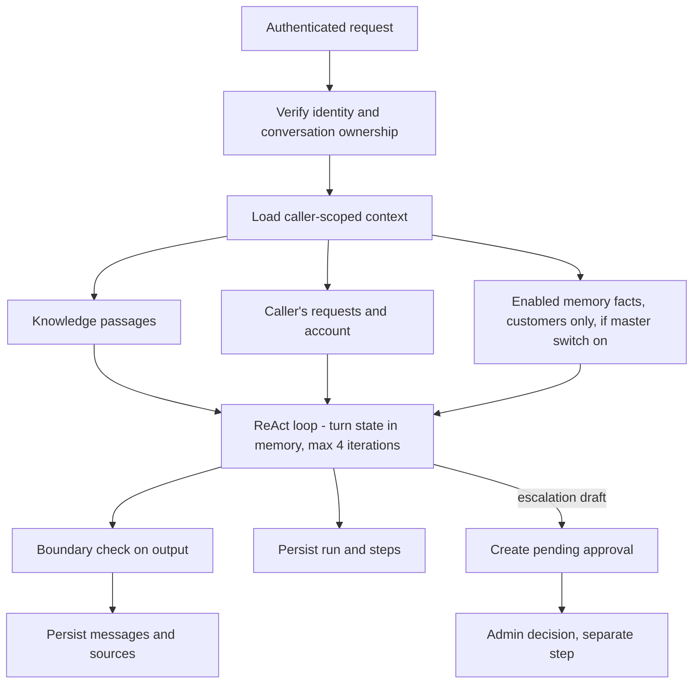

# State Model — RESOLV-HQ Support Assistant

**Week 6 — Memory, State and Interoperability** | **Date:** 9 Oct 2026

This document makes the system's state explicit: what exists, where it lives, who may change it, and how long it lasts. It complements the per-turn view in [`agent-task-contract.md`](./agent-task-contract.md) §3 and the memory rules in [`memory-design-and-data-handling-note.md`](./memory-design-and-data-handling-note.md). Table names are from `resolv-hq-backend/prisma/schema.prisma`; this document does not enumerate status values that are stored as free strings.

## 1. State layers

| Layer | Lifetime | Where it lives | Written by | Read by |
|---|---|---|---|---|
| **Turn state** | One chat turn | In memory inside `runReActLoop()` (`react-agent.ts`): messages, tool observations, iteration count | The loop | The loop; discarded when the turn ends |
| **Conversation state** | One chat thread | `ai_conversations`, `ai_messages`, `ai_message_sources` | Chat route, after the turn | The owning caller; staff via admin views |
| **Run state** | One agent run | `agent_runs`, `agent_steps`, `tool_executions`, `guardrail_events` | Chat route / agent loop | Admin traces |
| **Approval state** | Until decided | `agent_approvals` | Server records a pending row when a draft exists; only an admin can decide | Admin approvals queue |
| **Case state** | Life of the support case | `requests`, `request_status_history`, `request_messages` | Customer and staff via the API | Owning customer and staff |
| **Persistent memory** | Until deleted | `customer_memory` (+ `customer_profiles.memory_enabled`), `agent_memory_records`, audit in `customer_memory_access_logs` | See §3 | See §3 |
| **Tool-registry state** | Until changed by an admin | `agent_tools` (`is_active`) | Admin tools route | Chat loop and MCP server (checked on every call) |

## 2. Per-turn flow

Nothing from turn state carries to the next turn except what is persisted above. The model never writes memory.

## 3. Persistent memory: ownership and access

| Store | Owner | Create | Read | Update / delete | Loaded into model context |
|---|---|---|---|---|---|
| `customer_memory` | The customer (`customer_id`) | Customer via `POST /memory-facts` (max 50); staff for an explicitly selected customer (audited) | Customer via `/memory-facts`; staff via `/admin/memory/customers/:id` after selection (audited) | Customer: own facts and delete-all. Staff: selected customer's facts (audited) | Yes, for the owning customer only, if `memory_enabled` and fact `is_enabled`; budget-limited; marked untrusted |
| `customer_profiles.memory_enabled` | The customer | Default `true` | Customer, staff for a selected customer | Customer via `/me`; staff via preferences route (audited) | Master switch: when off, no facts are loaded |
| `agent_memory_records` | One staff member (`staff_id`) | That staff member | That staff member | That staff member | No: staff notes never enter customer chat |
| `customer_memory_access_logs` | System | Server, in the same transaction as the access | Admin only, via `GET /admin/memory/audit` | Not editable via the API; purged after 730 days when retention is on | No. Records actor, customer, action and optional record ID, never values |

## 4. State invariants

1. **Identity comes from the server.** Owners are derived from the verified token; no tool or endpoint takes a customer ID from the request body to select whose data is read, except the explicit, staff-only, audited customer-memory routes.
2. **Memory informs, never authorizes.** Facts are placed in the prompt as untrusted context. They are not an input to the boundary check, approval, or tool authorization.
3. **Consequential state changes need a human.** A draft becomes a real ticket only through `agent_approvals`; only an admin can decide.
4. **Tools do not mutate state.** All four agent tools are read-only or in-memory drafts, over chat and over MCP.
5. **Registry is re-checked per call.** Deactivating a tool takes effect on the next call (HTTP MCP and chat); a running stdio MCP process needs a restart to refresh its listing.
6. **Audit without values.** Staff access to customer memory is logged without the memory content.

## 5. Known gaps in the state model

Retention periods per layer are now stated in the [Memory Design and Data Handling Note](./memory-design-and-data-handling-note.md#retention-and-deletion): customer facts 365 idle days, audit log 730 days, idle conversations without runs 365 days, staff notes until deleted, and runs/approvals never auto-deleted. Customer export (`GET /memory-facts/export`) and an admin-only audit read (`GET /admin/memory/audit`) exist.

Remaining:

- The retention purge is implemented but **off by default** (`RETENTION_ENABLED=false`); nothing expires until it is turned on.
- The Supabase backup retention window has not been verified, so deletion cannot yet be called immediate everywhere.
- Staff notes and chat transcripts have no export.
- The in-memory Prisma tests (`npm test`) are supplemented by an opt-in real-database test (`npm run test:db`) covering the customer create/update/export/loader/delete path and a retention dry run. Staff audit writes and the purge's actual deletes have not been run against the real database.
